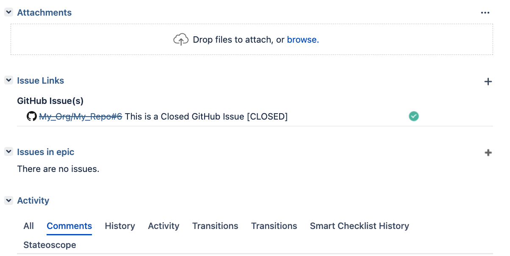

<!-- markdownlint-disable MD041 -->
<p align="center">
  
  <h2 align="center">Create Jira Link</h2>
  <p align="center">Create a Jira Link (remoteLink) to a GitHub Issue
   and attach it to Jira tickets</p>
</p>

---

<div align="center">

[](https://github.com/super-linter/super-linter)

[](https://github.com/fgerthoffert/actions-create-jira-link/actions/workflows/check-dist.yml)
[](https://github.com/fgerthoffert/actions-create-jira-link/actions/workflows/codeql-analysis.yml)
[](./badges/coverage.svg)

</div>

---

# About

The goal of this action is to create a remote link, to a GitHub issue, inside a
Jira ticket.



Jira ticket keys can be provided:

- Directly into the action configuration
- Via a text field in a GitHub project attached to the issue
- Via a label attached to the issue

Features:

- Adjust the state of the GitHub issue. Strikes the org/repository link, update
  an icon and optionally append "[CLOSED]" or "[OPEN]" to the issue title.
- Can be called regularly to maintain the GitHub issue state in sync with the
  link.
- Remove link ID is based on the GitHub Issue URL, changing the issue title in
  GitHub will be reflected in the link in Jira.
- Icons can be customized (see parameters)

# Usage

This action is meant at being started manually (i.e. to instantly push a new
label) and on schedule (i.e. to regularly check that all labels with the same
name have the same color and description).

```yaml
name: Sync Labels

on:
  workflow_dispatch:
  schedule:
    - cron: '0 5 * * *'

jobs:
  sync-labels:
    runs-on: ubuntu-latest
    steps:
      - name: Synchronize labels
        # Replace main by the release of your choice
        uses: fgerthoffert/actions-create-jira-link@main
        with:
          jira_issue_keys: TICKET-1234,PROJECT-4567
          jira_server_host: jira.somehost.com
          jira_server_username: my_username
          jira_server_password: my_password
```

# :gear: Configuration

## Input Parameters

The following input parameters are available:

| Parameter                   | Default Value                                          | Description                                                                                                                            |
| --------------------------- | ------------------------------------------------------ | -------------------------------------------------------------------------------------------------------------------------------------- |
| `token`                     |                                                        | A GitHub personal API token with privileges to access the issue details                                                                |
| `jira_issue_keys`           |                                                        | A comma separated list of Jira issues to create a link into (e.g. "PROJECT-1,TOOLS-2"). All these should be on the same Jira instance. |
| `github_project_field`      | `Jira Tickets`                                         | Name of a GitHub project field containing a comma separated list of Jira issues                                                        |
| `github_label_prefix`       | `jira:`                                                | Label prefix to be used for finding issues. For example if the label is "jira:PROJECT-1", the prefix should be "jira:"                 |
| `github_issue_id`           |                                                        | When providing a GitHub Issue ID (GraphQL ID) the action will use that ID instead of the one provided in the event payload.            |
| `jira_server_protocol`      | `https`                                                | Protocol to communicate with the Jira server. Default is "https".                                                                      |
| `jira_server_host`          |                                                        | The Jira server to connect to, for example "jira.somehost.com".                                                                        |
| `jira_server_username`      |                                                        | Username to connect to the Jira server                                                                                                 |
| `jira_server_password`      |                                                        | Password to connect to the Jira server                                                                                                 |
| `jira_server_api_version`   | `2`                                                    | Jira API version. Default is "2"                                                                                                       |
| `jira_server_strict_ssl`    | `true`                                                 | Enable string SSL. Default is "true"                                                                                                   |
| `jira_link_relationship`    | `GitHub Issue(s)`                                      | Relationship to display in the Jira issue. Default is "GitHub Issues(s)"                                                               |
| `jira_link_status_in_title` | `true`                                                 | Display the issue status in bracket next to the issue title (for example: My GitHub Issue [OPEN])                                      |
| `jira_link_icon_prefix`     | `https://github.githubassets.com/favicon.ico`          | Icon to be displayed in Jira next to the issue link (16x16px)                                                                          |
| `jira_link_icon_closed`     | `https://img.icons8.com/flat-round/16/checkmark.png`   | Icon to be displayed in Jira when the GitHub issue is closed                                                                           |
| `jira_link_icon_open`       | `https://img.icons8.com/ios/16/40C057/circled-dot.png` | Icon to be displayed in Jira when the GitHub issue is open                                                                             |

## Outputs

No outputs are available

# How to contribute

- Fork the repository
- npm install
- Rename .env.example into .env
- Update the INPUT\_ variables
- Do your changes
- npx local-action . src/main.ts .env
- npm run bundle
- npm test
- PR into this repository, detailing your changes

More details about GitHub TypeScript action are
[available here](https://github.com/actions/typescript-action)
